# Savor Safe - Restaurant Risk and Violation Predictor

## Cleaned Dataset link

https://drive.google.com/file/d/13NCxA09nFjxkwTDJlvkaELQ5jfarzt_s/view?usp=drive_link

## Overview

Foodborne illness remains a persistent public-health and economic problem in Chicago. Tens of thousands of restaurant inspections are conducted each year, but preventable violations and unsafe practices still slip through, leading to avoidable illness and reputational damage.  

SavorSafe uses historical food inspection data to:  

- Understand patterns behind inspection failures.  
- Predict which upcoming inspections are most likely to fail.  
- Identify recurring violation themes and geographical risk hotspots.  
- Support risk-based, data-driven inspection scheduling.  

## Team Members

| Team Member | Email | Github Link |
|-------|-------|-------|
| Shaunak Khedkar | skhed@uic.edu | [Github Profile](https://github.com/shaunak-khedekar22) |
| Dhru Prajapati | dpraj7@uic.edu | [Github Profile](https://github.com/Dhru2000) |
| Shreyas Chougule | schou47@uic.edu | [Github Profile](https://github.com/ShrecUIC) |
| Gauthami Ghadiyaram | gghad@uic.edu | [Github Profile](https://github.com/gghad-dotcom) |
| Swathi Kumar |  smoha121@uic.edu | [Github Profile](https://github.com/Swathi245786) |

## Key Facts

- City: Chicago, IL
- Raw dataset size: ~299,868 inspection records (2010–2025).
- Columns include: inspection ID, date, facility type, inspection type, risk level, result, violations, ZIP, latitude and longitude.

- Cleaned datasets:

    - food_inspections_clean_final.csv – fully processed dataset.
    - Models explored: Logistic Regression, Random Forest, Gradient Boosting, XGBoost, CatBoost, KNN, Naive Bayes, Isolation Forest, TF-IDF + Linear SVM, and hybrid tabular+text models.

## Problem Statement & Research Questions

Food inspections generate rich data but are not yet fully leveraged for proactive risk management. SavorSafe addresses:

- Patterns behind inspection failures
    - Which facility types (e.g., chains vs independents), risk levels, inspection types, and neighborhoods are most associated with failing inspections?
- Predicting high-risk inspections
    - Can historical inspection data and engineered features reliably forecast whether an upcoming inspection is likely to fail?
- Recurring violation themes
    - What violation topics occur most frequently (e.g., facility maintenance, cleanable surfaces, stocked sinks), and how have these evolved over time?
- Food safety hotspots
    - Are there specific ZIP codes or areas where violations and inspection failures consistently concentrate?

## Data Sources

- Primary Dataset:

    - Food Inspections – City of Chicago Data Portal
    - Includes restaurant inspections from January 1, 2010 to present, recorded by the Chicago Department of Public Health’s Food Protection Program.

## Data Preprocessing

The raw dataset required extensive cleaning and feature engineering before analysis. Major steps:

### Schema Standardization

- Mapped raw columns to a consistent schema: inspection_id, inspection_date, result_norm, risk_raw, facility_type, inspection_type, dba_name, license_id, zip5, lat, lon, violations_text, etc.

### Dropped redundant identifiers and legacy fields.

- Duplicates & Keys

### Removed exact duplicate rows.

- Enforced inspection_id as primary key, keeping the latest inspection_date when duplicates existed.

### Temporal Features

- Parsed inspection_date to datetime.
- Engineered year, month, year_month for trends and seasonality; filtered rows with missing dates.

### Result Normalization

- Collapsed heterogeneous results into a normalized set:
- PASS, PASS_CONDITIONS, FAIL, OUT_OF_BUSINESS, NO_ENTRY, NOT_READY, OTHER, UNKNOWN.
- Created is_fail = 1 if result_norm == FAIL.

### Risk Level Extraction

- Parsed risk_raw into numeric risk_level (1 = High, 2 = Medium, 3 = Low); non-standard entries left as null.

### Geospatial Quality Checks

- Coerced lat/lon to numeric; kept only points within a Chicago bounding box, set out-of-bounds coords to NaN.

### ZIP & Text Cleaning

- Extracted 5-digit ZIP (zip5), standardized text fields, and created violations_text_clean plus violation_count heuristics.

### Temporal Filtering & Export

- Created a focused 2018+ subset for recent trend analysis and ML evaluation.

## Methodology

SavorSafe combines:

- Data Cleaning & Feature Engineering
    - Built an ML-ready “ML-1” feature set capturing:
        - License-level history (prior inspections & failure rate)
        - ZIP-level history and risk buckets
        - Risk levels, inspection types, facility types
        - Seasonality (month sine/cosine) and violation counts

- Exploratory Data Analysis (EDA)

    - Visualized inspection volume and failure rates over time.
    - Analyzed month×day failure-rate heatmaps, risk by ZIP, facility types, and chain vs independent behaviour.
    - Examined violation text themes and failure-rate differences by inspection type and time since last inspection.

- Supervised Modelling
    - Classification models: Logistic Regression, Random Forest, Gradient Boosting, XGBoost, CatBoost, KNN, Naive Bayes.
    - Text model: TF-IDF + Linear SVM on violation descriptions.
    - Hybrid model: tabular features + text signal.

- Unsupervised / Anomaly Modelling
    - Isolation Forest on ML-1 features (passes only) to test purely anomaly-based failure detection.

- Operationalization
    - An Inspection Prioritization Tool that rebuilds ML-1 features daily, scores upcoming inspections, ranks them by predicted failure probability, and can be visualized on a map for inspectors.

## Key Findings

From visualizations and models, several strong patterns emerge:

- Failure Risk Is Highly Structured, Not Random
    - Certain licenses show persistently high failure rates over time.
    - ZIP codes with historically high failure rates continue to produce more failures, especially when combined with high-risk licenses.

- Seasonality & Calendar Effects
    - Failure rates spike in warmer months (June–September) and are lowest and most stable from November–February.
    - Mid-month days (10–20) often show elevated failure rates, suggesting operational or scheduling effects.

- Risk Levels & Inspection Types Matter
    - High-risk facilities (Risk 1) consistently fail more often than low-risk facilities (Risk 3), validating the risk classification scheme.
    - Complaint-driven and suspected food-poisoning inspections have much higher failure rates than routine canvass inspections, confirming that complaint triage is effective.

- Chains vs Independents
    - Chain restaurants show meaningfully lower and more stable failure rates than independent facilities, supporting the role of standardized processes and corporate QA.
     
- Time Since Last Inspection (TSLI) Is a Strong Signal
    - Failure rates increase as time since the last inspection grows, with sharp jumps after long gaps (e.g., >1 year), suggesting threshold-based scheduling rules could be effective.

- Violation Themes Are Persistent
    - The most common violations relate to facility maintenance, cleanable surfaces, and properly stocked sinks—structural and sanitation issues that recur over years.
    - Pest control and employee hygiene issues appear less frequently but remain critical when present.

- Model Performance Highlights Text as a Superpower
    - TF-IDF + Linear SVM on violation text achieves outstanding performance (AUROC ~0.97, PR-AUC ~0.92, high recall and precision), drastically reducing missed failures.
    - Among structured models, Random Forest and CatBoost deliver strong AUROC and PR-AUC, with clear lift in top risk deciles, making them ideal for risk ranking.
    - Pure anomaly detection with Isolation Forest performs poorly for failure prediction, underscoring the importance of labeled data and supervised learning.

## How This Helps Health Inspectors

- Risk-Based Scheduling
    - Models like Logistic Regression, CatBoost, Random Forest, and especially TF-IDF + SVM rank establishments by failure risk so inspectors can visit the riskiest licenses first.

- Targeted Resource Allocation
    - Combining license history, ZIP-level risk, and TSLI allows inspectors to prioritize:
        - Chronically non-compliant establishments,
        - High-risk ZIPs, and
        - Overdue inspections.

- Policy & Program Design
    - Insights about higher independent-restaurant failure rates and summer season spikes can guide targeted training, outreach, or stricter monitoring for specific groups and time windows.

- Operational Tooling
    - The Inspection Prioritization Tool converts model scores into a daily ranked list and map, making it straightforward to build more efficient inspection routes.

## Data Visualizations & Insights

### 1. Monthly inspections (bars) & Failure rate

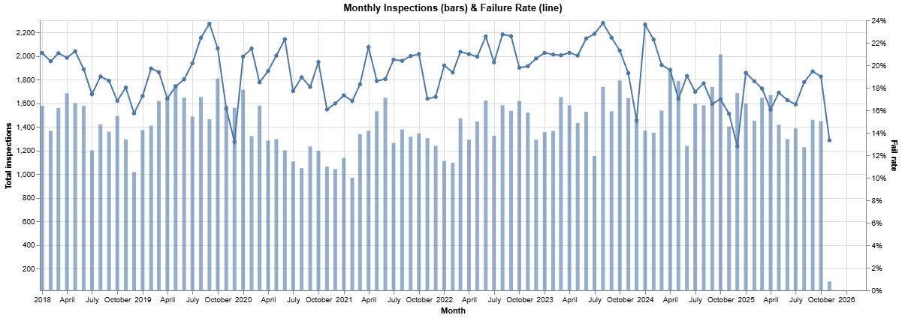

*  From 2018→present, inspection volumes fluctuate with a noticeable dip around early mid 2020 (pandemic impact), then rebound and stabilize. This sets the temporal context for all downstream analyses.
* The failure rate consistently tends to decline toward the end of the year, as observed from 2020 through the present. A similar downward trend is evident again in November 2025.
* Volume ≠ risk. High-volume months don’t automatically have higher failure rates; the two lines move somewhat independently. This hints at selection effects (which kinds of inspections were conducted) rather than simple seasonality.
* Because rate spikes likely reflect inspection-type mix (complaints, license checks) rather than time alone, we should stratify by Inspection Type and Facility/Risk—which is exactly what our hypotheses will explore.

### 2. Month × Day Heatmap Trends in Inspection Failure Rates

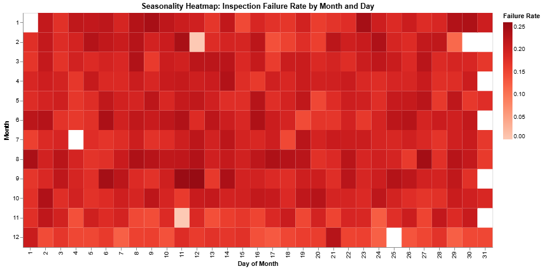

 Month × Day Heatmap Trends in Inspection Failure Rates:

*  Mid-month peaks: Failure rates are consistently higher around days 10–20, suggesting operational cycles, staffing shifts, or inspection scheduling influence outcomes.
*  Seasonal variation: Warmer months (late spring and summer) show elevated failure rates, while colder months (November–January) have lower rates, reflecting natural fluctuations in food handling risk.
*  Short-term spikes and hotspots: Specific days within months show sharp increases in failure rates, often due to complaint-driven or follow-up inspections.
*  Heterogeneity and abrupt transitions: Daily failure rates vary widely within the same month, and month-to-month changes are abrupt, indicating that inspection type, scheduling strategies, and establishment-specific risk drive patterns more than calendar time.

### 3. Chicago ZIPs: Inspections and Failure Rate Choropleth

* Higher failure rates concentrate on the South and Southwest sides, where several ZIP codes show darker red shading—indicating consistently elevated inspection failure rates compared to the citywide average.
* North and Northwest neighborhoods generally show lower failure rates, reflected by lighter shades, suggesting stronger compliance or fewer high-risk establishments in those regions.
* Central and near-west areas display mixed patterns, with some pockets of elevated risk but overall moderate fail rates—likely influenced by diverse restaurant density and mixed facility types.
* Geographic clustering is evident, implying that neighborhood-level factors—such as local enforcement patterns, establishment density, socioeconomic conditions, or historical compliance—may contribute to the spatial distribution of inspection failures.

### 4. Word Cloud and Horizontal Bar Chart

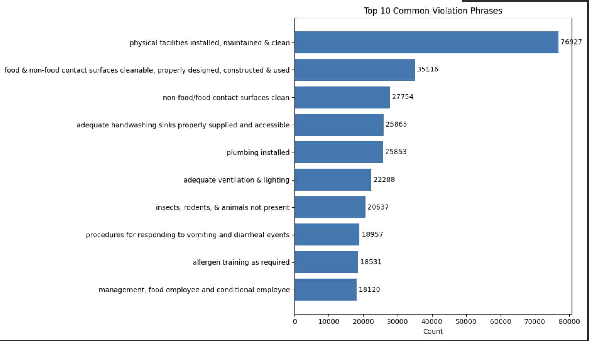

* From 2018 to 2025, the pattern of violations has remained largely stable, with the same recurring issues dominating each year. The most common categories such as maintaining physical facilities, ensuring cleanable food and non-food contact surfaces, and keeping hand-washing sinks properly stocked—point to ongoing maintenance and sanitation problems rather than occasional mistakes.
* The frequent appearance of these structural and cleanliness-related issues suggests they are rooted in long-term operational practices, not short-term lapses. In contrast, violations involving pest control or employee hygiene appear less common, indicating more consistent control in those areas.
* Overall, the trend shows that infrastructure upkeep covering areas like flooring, plumbing, and ventilation—continues to be the most persistent compliance challenge, while more immediate contamination or hygiene failures are relatively rare.

### 5. Violation counts vs inspection outcomes

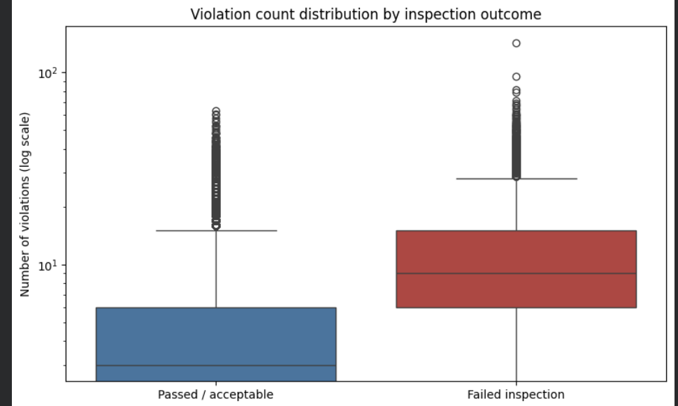

- We summarize violation_count by outcome and visualize it with a boxplot (log scale) and an overlapping histogram.
- This helps us see whether failures are typically associated with **more recorded violations**, or whether a small number of critical violations can also trigger failure.
- These patterns also motivate using violation_count as a predictive feature in our risk model

### 6. Interactive failure-rate heatmap by facility type

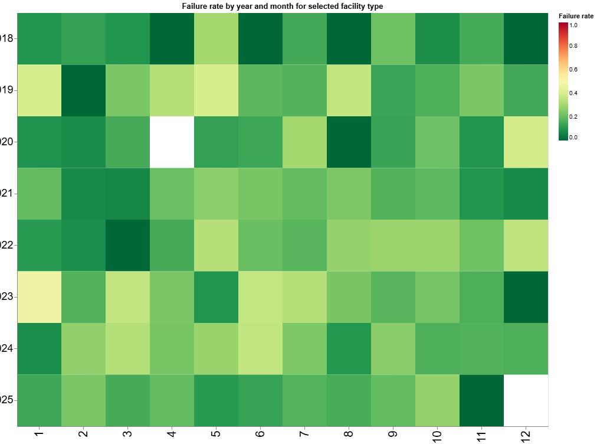

This interactive heatmap shows how **monthly failure rates** evolve over time for the top facility types:

- Each cell represents a **(year, month)** combination for the selected facility type.
- Color encodes the **inspection failure rate** for that month (red = higher failure rate, green = lower).
- A dropdown lets us switch between different facility types and compare their temporal risk patterns.

This helps us spot **seasonal patterns** or periods where certain facility types experience unusually high failure rates, which can guide targeted inspections or interventions.

### 7. License-level historical risk profile

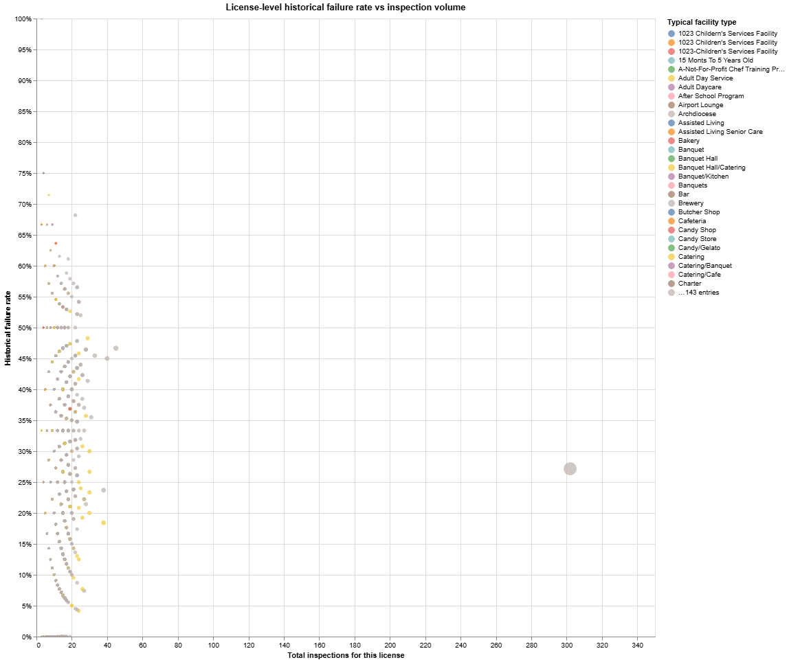

Here we aggregate inspections **per license (establishment)** and visualize:

- **Total inspections** on the x-axis.
- **Historical failure rate** on the y-axis.
- **Color = typical facility type** for that license.
- **Bubble size** scales with the number of inspections.
- A slider filters out licenses with very few inspections.

This helps identify:
- Establishments with **consistently high failure rates** (high on the y-axis),
- High-volume licenses that are almost always compliant,
- And whether certain facility types tend to have more “chronically risky” locations.

### 8. How failure rates evolve over time by risk level

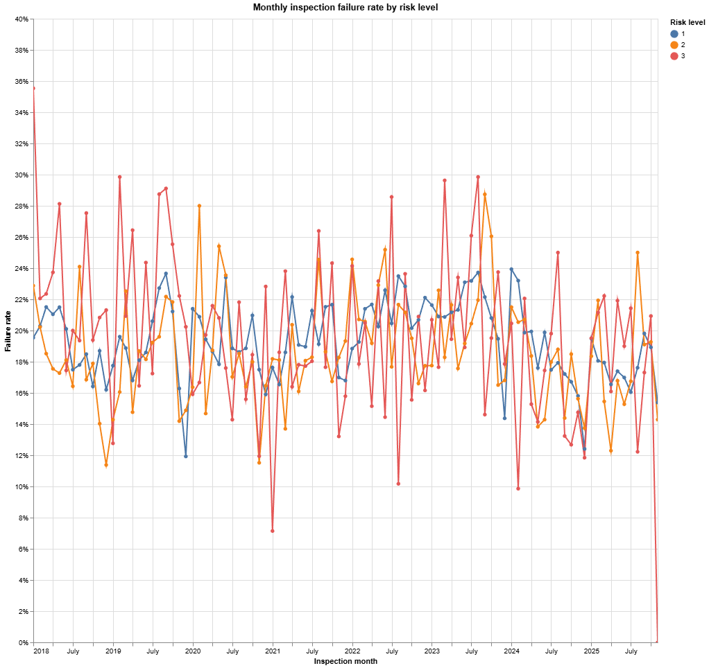

This line chart tracks how **failure rates** change over time for each **risk level**:

- The x-axis is the inspection month, the y-axis is the **failure rate**.
- Each line is a risk level (e.g., Risk 1 / 2 / 3).
- You can click entries in the legend to highlight specific risk levels.

This helps us see whether higher-risk categories are **consistently more likely to fail**, and whether certain periods show spikes for specific risk levels (useful for planning targeted inspections or seasonal campaigns).

### 9. Pass vs fail composition over time

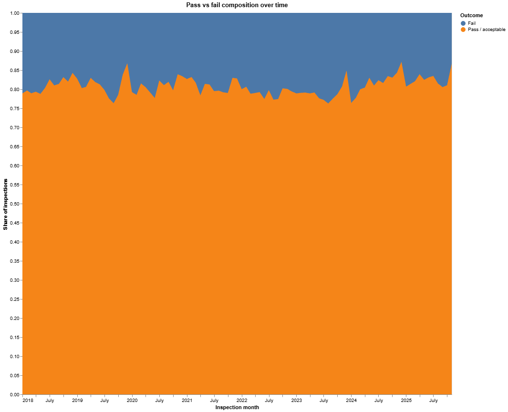

- The x-axis is the inspection month.
- The colored bands represent **Fail**, **Pass/acceptable**, and other outcomes.
- A toggle lets us switch between **percentage share** and **raw counts**.

This helps us see whether failures are becoming more or less common over time relative to total inspections, not just in absolute numbers.

### 10. Heatmap of license vs zip prior failure rates

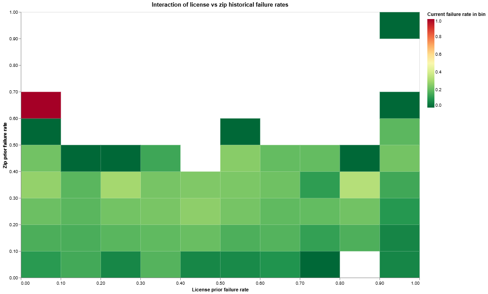

Here we examine how **establishment-level history** lic_prior_fail_rate and **neighborhood-level history** zip_prior_fail_rate jointly relate to the current inspection outcome:

- Each cell is a bin over (license prior fail rate, zip prior fail rate).
- Color encodes the **current failure rate** (`mean(is_fail)`) for inspections in that bin.
- This reveals whether inspections are most likely to fail when **both** the establishment and its surrounding area have poor histories, and whether one factor dominates the other.

It directly validates the inclusion of both history features in our predictive models.

### 11. Failure Rate by Inspection Type

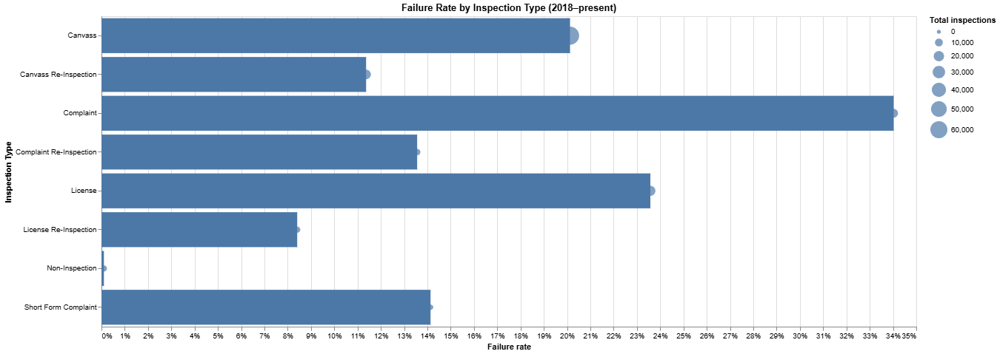

* Targeted programs (Complaint / Suspected Food Poisoning) show materially higher failure rates than routine canvass.
* Operational insight: If resources are tight, complaint intake seems to be an efficient triage channel—high hit rate.
* Remediation works: Lower rates on re-inspections suggest issues are often fixed by the next check.
* Policy note on License: Elevated failure on License visits may indicate barriers to compliance for new/renewing establishments—worth a deeper dive (common violations, training gaps).

This helps us see whether failures are becoming more or less common over time relative to total inspections, not just in absolute numbers.

### 12. Monthly Failure Rate

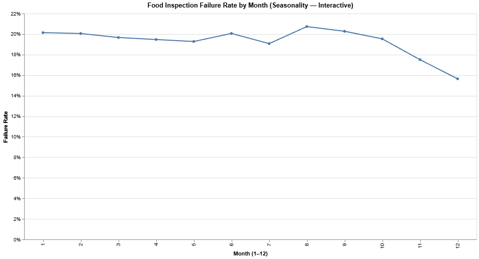

* Seasonal trend: Failure rates peak during the hotter months (June–September), indicating a seasonal influence on food safety outcomes.
* Operational insight: Elevated temperatures may increase microbial growth and strain refrigeration systems, leading to higher violation rates.
* Policy implication: Scheduling more frequent or targeted inspections during summer could mitigate seasonal risks.

This helps us see whether failures are becoming more or less common over time relative to total inspections, not just in absolute numbers.

### 13. High Risk vs Low Risk Failure Rate

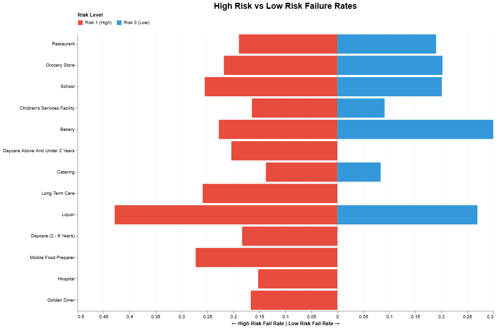

*   Reading the plot: Red bars (left of zero) are Risk 1 fail rates; blue bars (right of zero) are Risk 3 fail rates. Longer bars = higher fail rate; the vertical dashed line is 0 (the comparison pivot).
*   Overall signal: If, for most facility rows, the red bar extends farther than the blue, the hypothesis is supported (Δ > 0 for those facility types).
*   Exceptions to flag: Any row where the blue bar ≈ or > red is an outlier; check sample size (use the Min facility total slider), inspection-type mix (e.g., complaints vs canvass), seasonality, or potential risk misclassification.
*   Prioritization lens: Focus on facility types showing both a large Δ and large total N (hover tooltips) — these yield the biggest compliance impact for Risk-1 targeting and tailored training.

### 14. Chain vs Independent failure rate

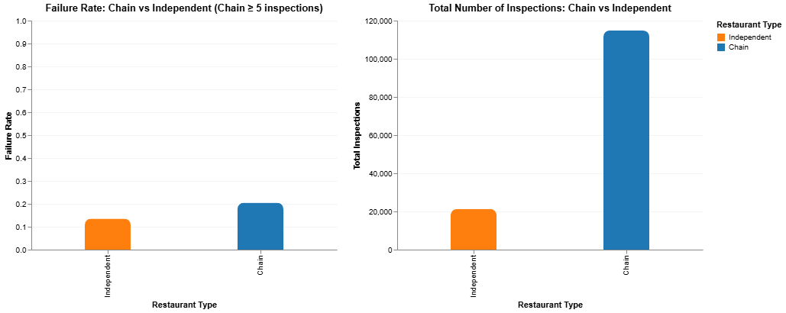

*   Chains have lower failure rates than independent restaurants.
*   Standardized procedures, corporate training, and centralized quality control likely explain chains’ better performance.
*   Independents show higher and more variable failure rates, possibly due to fewer resources and less formal safety processes.
*   Both groups have enough inspections to make the comparison reliable.
*   This suggests restaurant structure (chain vs independent) meaningfully affects food-safety outcomes.

### 15. Failure Rate by Time Since Last Inspection

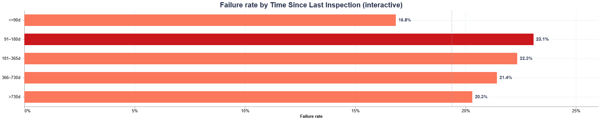

* A monotonic or stepwise increase in failure rate across TSLI bins (≤90d → >730d) supports the hypothesis that longer intervals elevate risk.​
* Flat or decreasing patterns would argue that cadence alone doesn’t drive failures once risk level and seasonality are considered.​
* If only specific bins spike (e.g., >365d), a threshold-based scheduling rule may be more efficient than uniform frequency increases.​
* Action: Pilot a prioritization queue that boosts inspection priority when TSLI exceeds a chosen threshold, then track violation mix changes to refine the rule.

## Machine Learning Models

Brief summary of each major model family (all evaluated on a 2018–2023 train / 2024+ test split):

- Logistic Regression (baseline)
    - AUROC ~0.65, PR-AUC ~0.28, high recall but many false positives.
    - Interpretable coefficients and solid baseline risk ranking.

- XGBoost & Gradient Boosting
    - Improved AUROC/PR-AUC vs logistic regression.
    - Capture non-linearities and interaction effects between history, risk level, seasonality, and geography.

- Random Forest
    - High accuracy and strong AUROC/PR-AUC (~0.91 / ~0.70).
    - Good balance between recall and precision, with clear top-decile lift.

- CatBoost
    - Top performer among structured models; handles mixed numeric + categorical features very well.
    - AUROC ~0.90, PR-AUC ~0.80, with balanced precision/recall.

- KNN & Naive Bayes
    - Serve as simpler baselines.
    - Struggle with high dimensionality and correlated features; limited lift compared to tree-based models.

- TF-IDF + Linear SVM (Violation Text)
    - Exceptional performance: AUROC ~0.97, PR-AUC ~0.92, recall ~0.93, precision ~0.81.
    - Uses n-gram text features from inspector violation descriptions, capturing rich semantic signals.

- Hybrid Tabular + Text Model
    - Combines structured ML-1 features with text-based signals for robust performance.

- Isolation Forest
    - Learns “normal” pass behaviour and flags anomalies, but AUROC < 0.5 and very low recall show that unsupervised anomaly detection alone is not sufficient for failure prediction.

## Inspection Prioritization Tool 

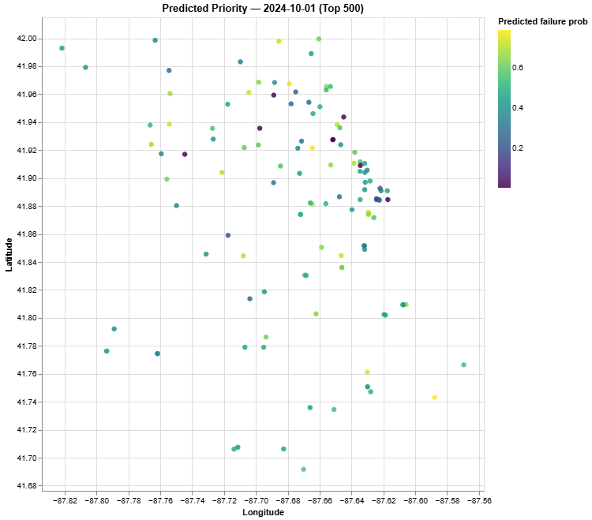

This tool turns our trained Logistic Regression risk model into a **daily inspection scheduler**:

- **Rebuilds ML-1 features:**  
  For all inspections in `df_eda`, it recomputes the same features used in training:
  risk level, seasonal month sin/cos, `zip5_bucket`, and history-based features
  (prior inspections and prior failure rates per license and ZIP), all in correct
  temporal order to avoid leakage.

- **Focuses on a specific date:**  
  It filters this feature table to inspections scheduled on the chosen `target_date`
  (e.g., 2024-10-01), drops rows missing features or coordinates, and then uses
  `log_clf.predict_proba()` to get a **predicted failure probability** for each
  inspection on that day.

- **Ranks inspections by risk:**  
  Inspections are sorted from highest to lowest `fail_prob`, and the top *K*
  (e.g., 500) become the **priority list**. This table shows ID, date, name,
  result, risk, number of violations, ZIP, and predicted failure probability.

- **Maps high-risk locations:**  
  An Altair scatterplot places these inspections by longitude and latitude, with
  **color = predicted failure probability** and rich tooltips for details. This
  gives inspectors a **spatial view of the daily high-risk targets**, helping
  them decide where to go first and how to route their day.

## Conclusion

- This project demonstrates that data-driven modelling can significantly improve health inspection prioritization by predicting which establishments are most likely to fail future inspections. Through systematic feature engineering, temporal leakage-free design, and comprehensive evaluation across multiple model families, we find that supervised learning methods—especially Logistic Regression with ML-1 features, CatBoost, and the Hybrid Tabular + Text model-deliver strong and operationally useful performance.
- This project demonstrates that data-driven modelling can significantly improve health inspection prioritization by predicting which establishments are most likely to fail future inspections. Through systematic feature engineering, temporal leakage-free design, and comprehensive evaluation across multiple model families, we find that supervised learning methods-especially Logistic Regression with ML-1 features, CatBoost, and the Hybrid Tabular + Text model-deliver strong and operationally useful performance.
- This project demonstrates that data-driven modelling can significantly improve health inspection prioritization by predicting which establishments are most likely to fail future inspections. Through systematic feature engineering, temporal leakage-free design, and comprehensive evaluation across multiple model families, we find that supervised learning methods-especially Logistic Regression with ML-1 features, CatBoost, and the Hybrid Tabular + Text model-deliver strong and operationally useful performance.
- This project demonstrates that data-driven modelling can significantly improve health inspection prioritization by predicting which establishments are most likely to fail future inspections. Through systematic feature engineering, temporal leakage-free design, and comprehensive evaluation across multiple model families, we find that supervised learning methods-especially Logistic Regression with ML-1 features, CatBoost, and the Hybrid Tabular + Text model-deliver strong and operationally useful performance.